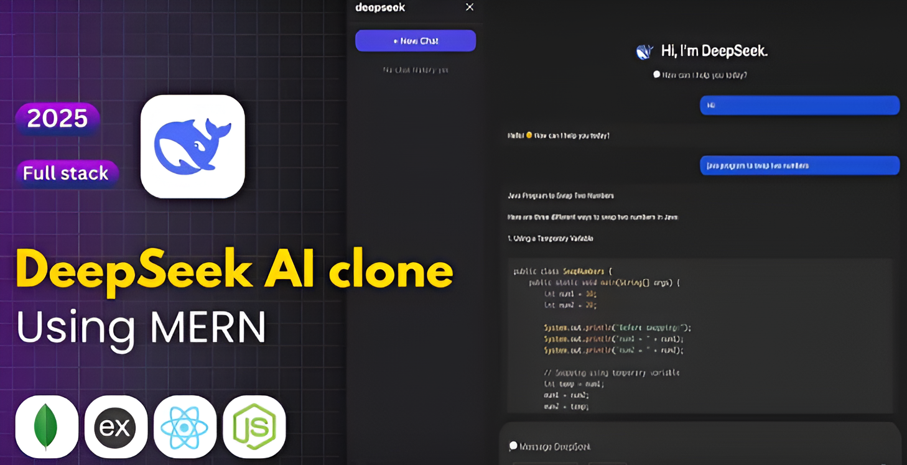

✨ DeepSeek Clone – MERN Stack ✨

An advanced AI chat & reasoning platform inspired by DeepSeek, built with the MERN stack and modern real-time technologies.

🚀 Overview

The DeepSeek Clone is a full-featured AI chat application that replicates DeepSeek’s smart reasoning, fast responses, multi-agent workflow, and chat memory. Built with the MERN stack, it includes user authentication, chat history, multi-model support, and a robust API integration layer.

🌟 Key Features

🛠️ Tech Stack: MongoDB, Express.js, React.js, Node.js (MERN)
j
🤖 AI Model Integration: Supports multiple LLM providers ( DeepSeek API)

🔄 Real-Time Responses: Streaming outputs for live typing effect

🧠 Chat Memory: Automatically store & retrieve conversation history

📂 Project-Based Chats: Multi-thread conversations with folders

🔐 User Authentication: JWT auth + protected routes

⚙️ Prompt Engineering Tools: System prompts, temperature, max tokens

🔍 Message Search: Search across conversation history

🌙 Light & Dark Themes: Modern UI based on DeepSeek's design

📊 Usage Analytics: Requests, tokens, cost tracking (optional)

☁️ Production Ready: Environment variables & deployment setup included

📝 Environment Setup
1. Create a .env file for the backend
PORT=
MONGO_URI=""
JWT_PASSWORD=""
NODE_ENV=
OPENAI_API_KEY=
FRONTEND_URL=

2. Create a .env file for the frontend
VITE_API_URL= http://localhost:5000

▶️ Run the Project
Backend
cd backend
npm install
npm run dev

Frontend
cd frontend
npm install
npm run dev

👨‍💻 Author
Amine Ould Medjeber
Full-Stack Developer | Node.js • React • MongoDB • Express.js
📧 [ouldmedjeberamine@gmail.com]
🌐 [www.linkedin.com/in/amine-medjeber]

